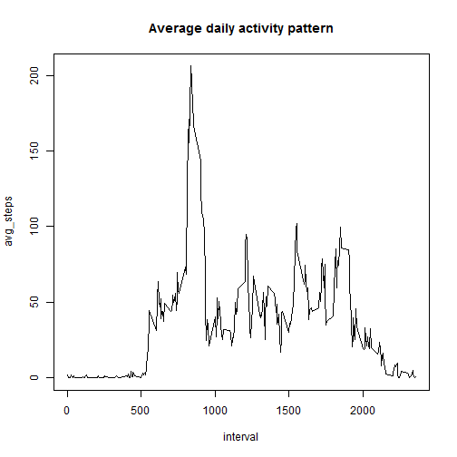
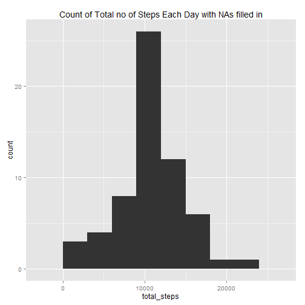

##Loading and preprocessing the data


```r
library(dplyr)
library(ggplot2)
library(lubridate)
dat <- read.csv("activity.csv")
result <- dat %>% group_by(date) %>% summarize (total_steps = sum(steps,na.rm = TRUE ))
```

##What is mean total number of steps taken per day?


```r
g<- ggplot(result, aes(total_steps))
g+geom_histogram(binwidth = 3000)+ggtitle("Count of Total no of Steps Each Day")
```

 

```r
mean_tot_steps <-mean(result$total_steps)
median_tot_steps <- median(result$total_steps)
```
mean total steps taken per day is 9354.2295082

median total seps taken per day is 10395

##What is the average daily activity pattern?


```r
result1 <- dat %>% group_by(interval) %>% summarize(avg_step = mean(steps, na.rm = TRUE))
plot(result1$interval, result1$avg_step, type="l", xlab = "interval", ylab = "avg_steps",main="Average daily activity pattern")
```

 

```r
interval_of_max_avg_step <- result1[result1$avg_step == max(result1$avg_step),][1,1]
```
Interval with maximum no of avg steps is 835

##Imputing missing values with interval averages


```r
no_missing_values <- nrow(dat[is.na(dat$steps),])
```

no of missing values in the dataset is 2304


```r
ndata <- dat[is.na(dat$step),]
x <- vector()
for(n in c(1:2304)){x[n] <- result1[result1$interval== ndata[n,3],][1,2]}
xf <- data.frame(unlist(x))
result2 <- cbind(ndata,xf)
result2 <- mutate(result2, steps = unlist.x.)
result2 <- select(result2, steps:interval)
#append result2 to original dataframe sans the missing value rows 
new <- rbind(dat[!is.na(dat$steps),],result2)
#total number of steps taken each day
result3 <- new %>% group_by(date) %>% summarize (total_steps = sum(steps ))
#histogram for new dataframe with total steps per each day
g3<- ggplot(result3, aes(total_steps))
g3+geom_histogram(binwidth = 3000)+ggtitle("Count of Total no of Steps Each Day with NAs filled in")
```

 

```r
mean_tot_steps_nafil <- mean(result3$total_steps)
median_tot_steps_nafil <- median(result3$total_steps)
```

mean total steps taken per day with NAs filled in  is 1.0766189 &times; 10<sup>4</sup>

median total seps taken per day with NAs filled in  is 1.0766189 &times; 10<sup>4</sup>

###What is the impact of imputing missing data on the estimates of the total daily number of steps?

Mean and median values have increased after the NAs were filled in with interval averages. Also the median and mean values have become one and the same.

##Are there differences in activity patterns between weekdays and weekends?


```r
new1 <- mutate(new, day = ifelse(wday(new$date,label=TRUE) %in% c("Sat", "Sun"), "weekend", "weekday"))
result4 <- new1[new1$day == "weekday",]
result5 <- new1[new1$day == "weekend",]

#plot avg steps for each interval in respect of weekday and weeend
par(mfrow = c(2,1))
plot(result5$interval, result5$avg_steps, type="l",xlim=c(0,14000),col="green", main = "Weekends",xlab = "interval", ylab = "avg_steps")
plot(result4$interval, result4$avg_steps, type="l",xlim=c(0,14000),col="red", main = "Weekdays",xlab = "interval", ylab = "avg_steps")
```

 

